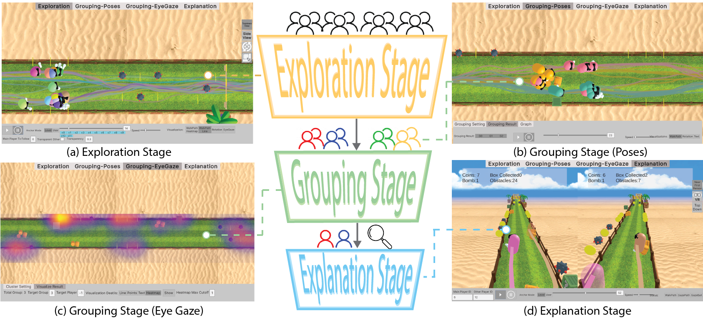

---
title: "HieraVisVR"
authors:
- admin
- "Erdem Murat, Liuchuan Yu, Haikun Huang, Minsoo Choi, Christos Mousas, Lap-Fai Yu"
date: "2026-02-28"
doi: ""

# Publication type (1 = Conference, 2 = Journal, 3 = Preprint)
publication_types: ["1"]

abstract: "Playtesting is widely used in the game industry to identify design flaws and evaluate player experience, yet little research explores how to effectively visualize and analyze playtesting data. This challenge is particularly pronounced in motion-based VR games, which involve physical movements and interactions tracked through multimodal inputs, resulting in complex multidimensional data. To better understand the challenges designers face, we conducted a formative study with 30 practitioners in the VR domain to characterize playtesting workflows and associated tasks. 
Based on these findings, we present HieraVisVR, \blue{a hierarchical visual analytics framework} that incorporates body-motion-related data to help designers identify player behaviors and critical game moments, simplifying their workflow. We demonstrate the applicability of HieraVisVR in three different applications and evaluate our system with playtesting experts through an analysis of motion-based game data. The study results suggest that our system enhances playtesters' understanding of the gameplay and improves their data analysis workflow. "

# Summary for the homepage (keep it under 200 characters)
summary: "A brief look at our new framework for VR analytics."

tags:
- HCI
- Virtual Reality Playtesting
- Visual Analytics

featured: true

# Links (Add URLs or leave empty)
url_pdf: "https://yqz530.github.io/paper/vrtest.pdf"
url_code: ""
url_dataset: ""
url_video: "https://youtu.be/mFpQj-F7muU"
---

### Project Overview
You can write regular Markdown here. If you need to include a formula, use LaTeX:

$$E = mc^2$$

You can also add extra images using standard markdown:
